# JDBC-STUDENT-ATTENDENCE-SYSTEM :star_struck:

[](https://shields.io/) [](https://shields.io/) [](https://shields.io/) [](https://shields.io/) [](https://shields.io/) [](https://shields.io/)
<br>
***This new Web application is created by Biswarup Bhattacharjee, student of BTECH, in University of Engineering and Management, Kolkata.***

**Email Id: bbiswa471@gmail.com.** 

**Contact No: 916290272740.** 

[](https://www.facebook.com/biswarup.bhattacharjee.5811) [](https://github.com/biswa2210)

## About :point_down: 
Student attendence management system deal with the maintenance of the student’s attendance details. It is generates the attendance of the student on basis of presence in class. It is maintaining daily basis of attendance, the staff will be provide with the separate username and password to make student attendance. The staff handling the particular subject to responsible to make the attendance for all students. Only if the student presents the particular date, the attendance will be calculated. The student attendance report based on monthly and consolidate will be generated. Student Attendance Management System is developed for daily student attendance in schools, colleges and institutes. It facilitates to access the attendance information of a particular student in a particular class. The information is sorted by the operators, which will be provided by the teacher for a particular class. This system will also help in evaluating attendance eligibility criteria of a student. The purpose of developing attendance management system is to computerized the tradition way of taking attendance. Another purpose for developing this software is to generate the report automatically at the end of the session or in the between of the session. The scope of the project is the system on which the software is installed, i.e. the project is developed as a desktop application, and it will work for a particular institute. But later on the project can be modified to operate it online. Attendance Management System basically has two main modules for proper functioning:- First module is admin which has right for creating space for new batch. Any entry of new faculty, Updating in subject if necessary, and sending notice. Second module is handled by the user which can be a faulty or an operator. 

## Purpose :point_down:
The goal of the project is to create a student attendance management system where the students can give the attendance for the respective subjects. The faculty of each subject can track the attendance of every student. Hence there will be efficient management of attendance.

## Use :point_down:
User has to run the project after opening it in eclipse or idea intellij. Then he has to see the menu. Accordingly he can choose options for specific tasks like adding records, deleting, searching or view records. These types of tasks can be done easily. Wrong credentials will note be taken. If same type of record for some specific cases is given then the program will not work for that. After using user can exit the program. From SQL environment also database can be accessed. This program is made with just real world idea. It is simple and efficient.

## Future Scopes:point_down:
Rather than designing manually we have made use of computer as once that data’s are input it performs accurate function. There is no chance of fault or miscalculation if the data are feeded correctly. Use of the computers has solved many problems, which are faced while manual calculation. This is not the end but beginning of the versatile, efficient and outsourcing railway reservation system. This is the one which is compatible to all operating system. By making this project we made a small footstep towards the path of progress of platform independent railway reservation system. After successful implementation of Railway Reservation System, it will help to the management for managing task efficiently. This gives satisfactory outputs as per required by the End User. This system also has extensibility feature that allows the users to fulfill their additional requirements in the current system. After testing, the system gives same outputs as expected. Railway Reservation System is made economically, technically sound, and providing Efficiency.

## Folder Structure :point_down:
```bash
JDBC-STUDENT-ATTENDENCE-SYSTEM
     ├── .settings
     |       └── org.eclipse.jdt.core.prefs
     ├── bin
     |     ├── com/student/manage
     |     |         ├── Attendence.class
     |     |         ├── ConnectionEstablish.class
     |     |         └── ConnectionOpratios.class
     |     ├── Operations.class
     |     ├── menuItems.class
     |     └── menu.class 
     ├── src
     |     ├── com/student/manage
     |     |         ├── Attendence.java
     |     |         ├── ConnectionEstablish.java
     |     |         └── ConnectionOpratios.java
     |     ├── Operations.java
     |     └── menu.java
     ├── .classpath
     └── .project
```                       

## Making :point_down:
FUNCTIONAL REQUIREMENTS:
Requirement analysis is a software engineering technique that is composed of the various tasks that determine the needs or conditions that are to be met for a new or altered product, taking into consideration the possible conflicting requirements of the various users.
Functional requirements are those requirements that are used to illustrate the internal working nature of the system, the description of the system, and explanation of each subsystem. It consists of what task the system should perform the process involved, which data should the system holds and the interfaces with the user. The functional requirement identified are:
a.	Adding Attendence:
All the required students’ attendence details containing their name, roll number, enrolment number, stream and others are added when we choose option 1 in menu.
b.	Fetch Attendence Details:
All the added records are stored in a database and are fetched and showed . We can fetch any of them when we choose option 2 in menu.
c.	All Attendence:
All the added records are stored in a database and are fetched and showed when we choose option 3 in menu.
d.   Total Class IDs:
We can choose option 4 when we want to see all class IDs.
e.	Search Student:
When we want to search any record we have to choose option 5 in menu.
f.   Delete record by serial number:
When we want to delete a student’s record we have to choose option 6 and choose that record. Then that record will be deleted.
g.	Exit Program:
If we want to exit the program we have to choose option 5. Then the program will be closed.
We have used Idea Intellij Software for java and MySql for sql.
JDBC Connectivity:
We have created a project in Idea Intellij IDE. We have created 4 java files in src folder. These are Menu.java, Operations.java, ConnectionEstablish.java, ConnectionOperatios.java, Attendence.java. 
We have successfully established a connection with the relation database model with ‘ConnectionEstablish.java’ and created a new database called “attendence_record” using mysql .With the specified root route and in the specified location (here localhost ) with particular username and password we have established a smooth connection with our java project. Handling records and searching for them becomes easier which such database management system.
Such error handling, easy searching and safer security of storing data is only being established with the help of this Java Database Connectivity.
A JAR is a package file format was included in order to provide the connectivity of our database , typically used to aggregate many Java class files and associated metadata and resources into one file for distribution. JAR files are archive files that include a Java-specific manifest file. They are built on the ZIP format and typically have a .jar file extension.
Non-functional requirements:
It describes aspects of the system that are concerned with how the system provides the functional requirements. They are:
a.	Security:
The subsystem should provide a high level of security and integrity of the data held by the system, only authorized personnel of the system can gain access to the system’s secured page on the system.
b.	Performance and Response Time:
The system should have high performance rate when executing user’s input and should be able to provide the response within a short time span usually seconds for highly complicated task and 20 to 25 seconds for less complicated task.
c.	Error handling:
Error should be considerably minimized and an appropriate error message that guides the user to recover from an error should be provided. Validation of user’s input is highly essential. Also the standard time taken to recover from an error should be 15 to 20 seconds.
d.	Availability: 
This system should always be available for access at 24 hours, 7 days a week. Also in the occurrence of any major system malfunctioning, the system should be available in 1 to 2 working days, so that the business process is not severely affected.
e.	Ease of use:
Considered the level of knowledge possessed by the user of this system, a simple but quality user interface should be developed to make it easy to understand and required less training. 

## Screenshots :point_down: 
<div align="center">
<a href="at1.jpeg">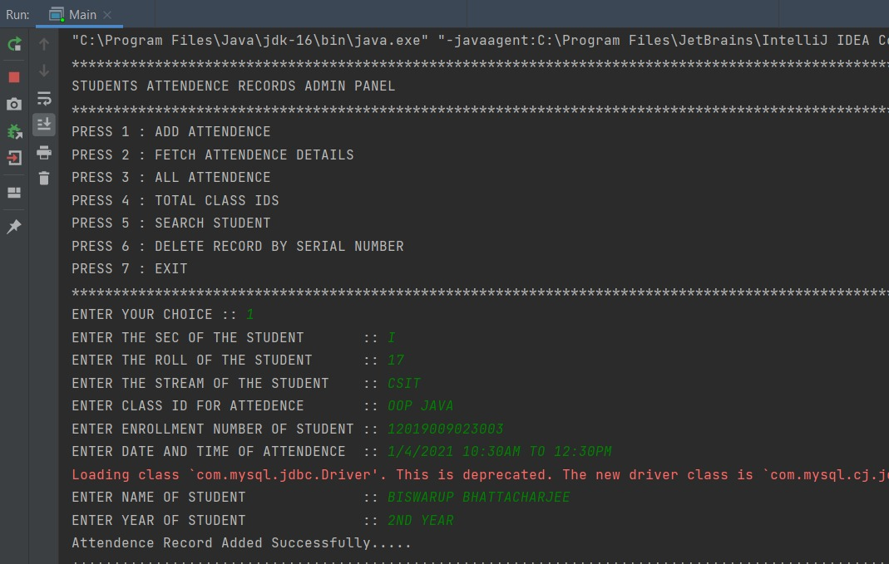</a> 
     
<a href="at2.jpeg"></a>

<a href="at3.jpeg">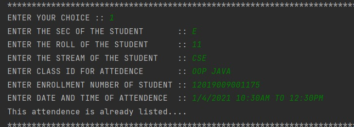</a> 

<a href="at4.jpeg">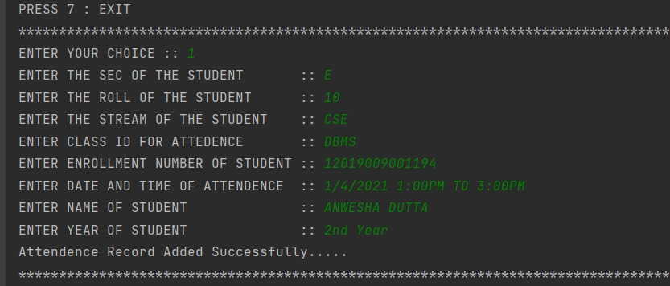</a>

<a href="at5.jpeg">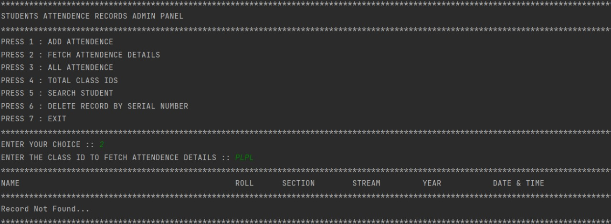</a> 

<a href="at6.jpeg">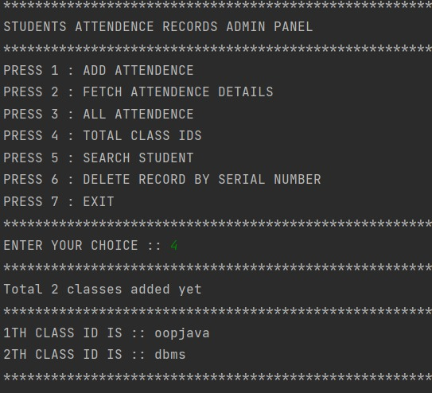</a>

<a href="at7.jpeg">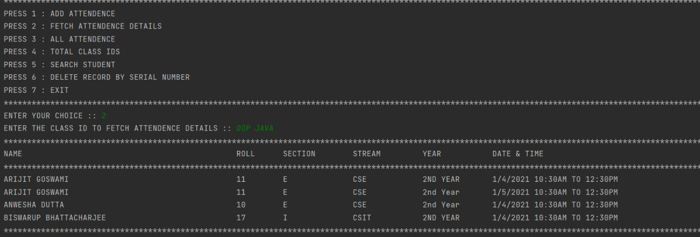</a> 

<a href="at8.jpeg">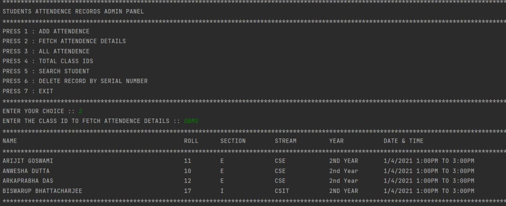</a>

<a href="at9.jpeg">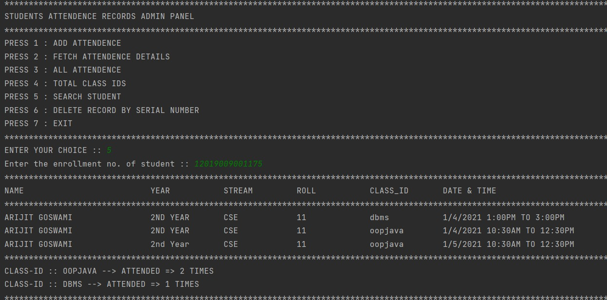</a> 

<a href="at10.jpeg">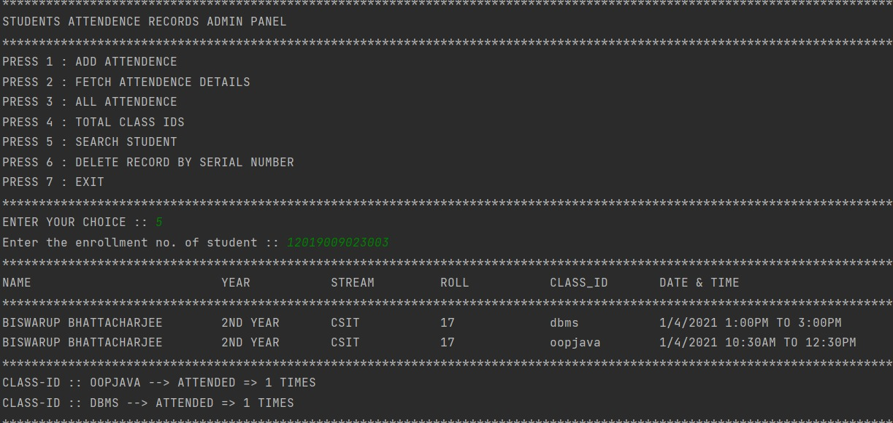</a>

<a href="at11.jpeg"></a> 

<a href="at12.jpeg">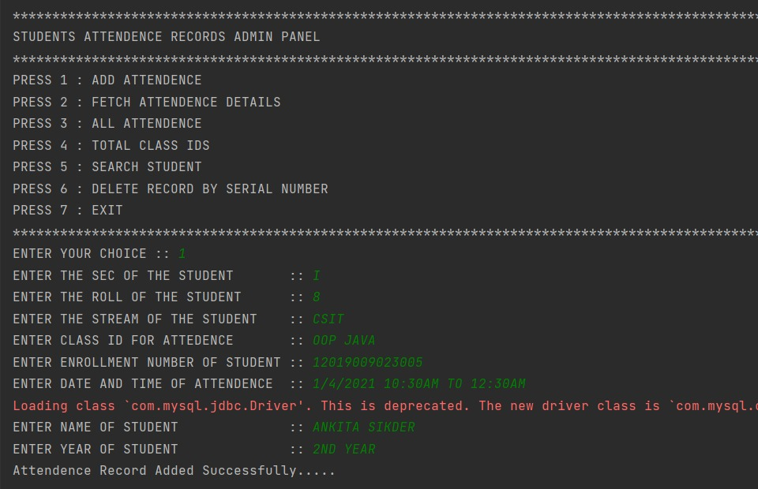</a>

<a href="at13.jpeg">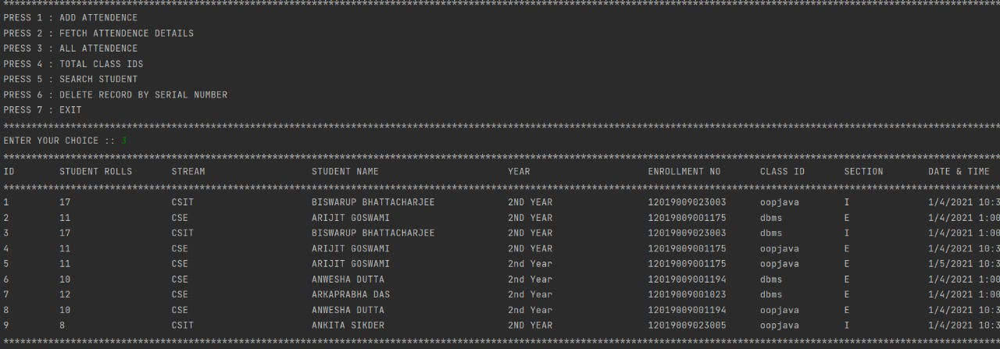</a> 

<a href="at14.jpeg">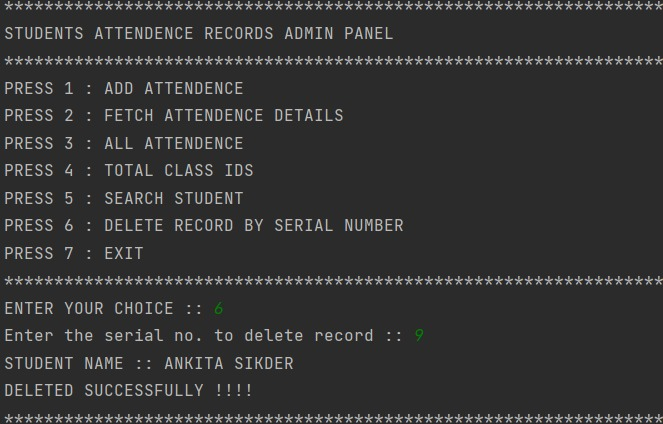</a>

<a href="at15.jpeg">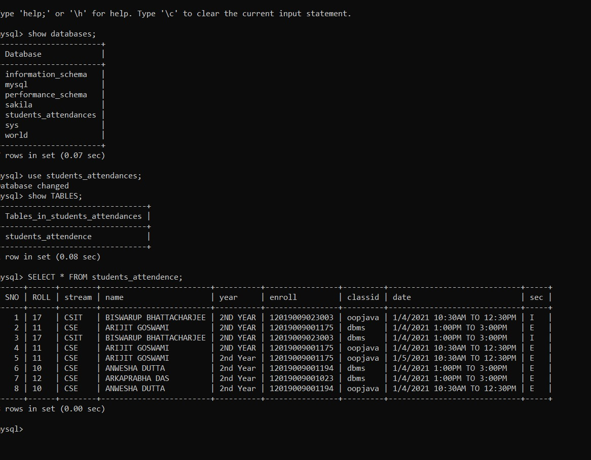</a>
</div>


